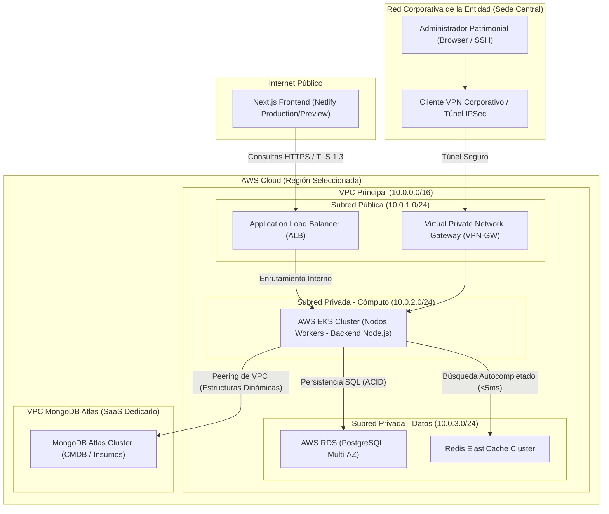

# Informe Inicial de Proyecto: Caso de Negocio y Arquitectura Cloud para ENOCOMATIK

---

## 1. Introducción y Caso de Negocio Corporativo

### 1.1. Definición del Problema y Justificación
La parálisis operativa en los servicios públicos digitalizados representa uno de los mayores cuellos de botella de la administración moderna. En las municipalidades y entidades descentralizadas de gobierno, el trámite ciudadano presencial está altamente condicionado por la disponibilidad de hardware de digitalización (escáneres documentales). La problemática de **ENOCOMATIK** se fundamenta en tres elementos críticos:
1.  **Fallas Crónicas de Hardware:** Falta de trazabilidad y mantenimiento de activos TIC, lo que genera interrupciones del servicio directo al ciudadano de hasta 12 días promedio.
2.  **Pérdida de Trazabilidad de Repuestos en Campo:** Pérdida sistemática de repuestos de alta rotación (ej. *rollers EAN*) asignados a técnicos en comisiones rurales de más de 7 días, debido a la falta de un control lógico e individual de inventario.
3.  **Brechas Administrativas:** Dificultad para cumplir con las directrices regulatorias de la Contraloría debido al retraso en la emisión de las actas de baja definitiva (`INF-BAJA`) y de renovación (`INF-RENOV`).

La justificación de este proyecto radica en la modernización de los canales de atención pública mediante un sistema unificado y en tiempo real de gestión de activos (CMDB) y control de personal técnico en campo.

### 1.2. Impacto Social e Institucional bajo el Marco ITIL v4
El marco **ITIL v4** define la co-creación de valor entre el proveedor del servicio y el usuario. Al analizar ENOCOMATIK bajo las prácticas de ITIL v4, identificamos el impacto directo en las siguientes dimensiones:
*   **Service Financial Management (Gestión Financiera del Servicio):** Optimización del gasto en repuestos de alta rotación (EAN). La trazabilidad digital mitiga las pérdidas de componentes, logrando amortizar la inversión en mantenimiento.
*   **Service Asset and Configuration Management - SACM (Gestión de Activos y Configuración):** Implementación de una base de datos de gestión de configuración (CMDB) que unifica el hardware y sus componentes lógicos, permitiendo un mapeo exacto de dependencias de red (IPs y hosts).
*   **Service Desk & Incident Management (Mesa de Servicio y Gestión de Incidentes):** Reducción drástica del tiempo medio de resolución de incidentes (MTTR) mediante un triaje automatizado con modo de contingencia que previene la parálisis del ingreso de tickets ante caídas de la red central.
*   **Impacto Social (Valor Público):** Reducción de los tiempos de espera del ciudadano en ventanilla de trámite. Al digitalizar y automatizar los recambios y las aprobaciones, se restituye la confianza del ciudadano en las instituciones gubernamentales y se garantiza la continuidad operacional del servicio público.

### 1.3. Relación con el Diseño de Interfaz y Flujo de Procesos
La arquitectura técnica descrita en este informe provee el soporte para las interfaces detalladas en el [Documento de Análisis Inicial y Diseño de Baja Fidelidad](file:///d:/ECONOMATIK/documento_analisis_diseno_enocomatik.md):
1.  **Modo de Contingencia (Triaje Inbound):** El desbloqueo de inputs de la interfaz interactúa con un middleware de backend que, al detectar la bandera de contingencia activa, desvía el payload para cifrarlo a nivel de base de datos bajo la estructura `datos_contingencia_cifrados` utilizando criptografía simétrica AES-256. Esto evita que los sistemas satélites bloqueen al operario por inconsistencias lógicas en plena atención ciudadana.
2.  **Lógica del Tablero Kanban:** Los estados del flujo de negocio en el tablero (`'To Do'`, `'In Progress'`, `'En Tránsito a Taller'`, `'Done'`) y la transición a `'En Ruta'` para repuestos en tránsito se mapean como una máquina de estados controlada en PostgreSQL para asegurar la integridad de la auditoría.
3.  **Monitoreo del Aging Logístico (Panel de Custodia):** La cuenta regresiva de 48 horas en el panel de control gatilla un middleware programado en Node.js que deshabilita los permisos de retiro de inventario al rol `tecnico` en caso de mora en la regularización del stock en tránsito.
4.  **Generación de Informes y Transición de Red (Vista Admin):** Las acciones `INF-BAJA` e `INF-RENOV` ejecutan microservicios específicos. El primero ejecuta scripts de red para liberar la dirección IP asignada al instante. El segundo provisiona el nuevo CPU heredando la identidad de red (IP/host) del antiguo, el cual es limpiado y registrado temporalmente como "En Almacén (Para Reasignar)".

---

## 2. Especificación del Modelo de Arquitectura Híbrida

### 2.1. Arquitectura Cliente-Servidor Desacoplada y Seguridad de Canal
El sistema adopta un modelo desacoplado compuesto por:
*   **Capa de Presentación (Frontend):** Construido en Next.js 14+ utilizando el paradigma de App Router con Server-Side Rendering (SSR) y Static Site Generation (SSG). Esto garantiza que la carga inicial de JavaScript (First Load JS) se mantenga por debajo de los 150KB gzip, asegurando compatibilidad con anchos de banda reducidos en sedes rurales. Cumple estrictamente con las directrices de accesibilidad WCAG 2.1 AA y el estándar ARIA.
*   **Capa de Negocio (Backend):** Una API implementada en Node.js, Express.js y TypeScript.
*   **Seguridad del Canal y Acceso:** La comunicación viaja sobre HTTPS utilizando **TLS 1.3** a través de una red VPN corporativa privada. La seguridad a nivel de aplicación implementa:
    *   **OAuth2 (Authorization Code Flow)** para la autenticación de usuarios.
    *   **Tokens JWT Asimétricos Internos** firmados con llaves privadas/públicas para la autenticación entre microservicios.
    *   **Middleware RBAC (Role-Based Access Control)** para restringir accesos según los roles (`tecnico`, `administrador`).

### 2.2. Justificación del Modelo Híbrido de Persistencia
Para soportar la diversidad de datos del negocio (transaccional, polimórfico y de alta velocidad), se ha diseñado una arquitectura de base de datos híbrida:

```
                                 ┌──────────────────────────────────┐
                                 │      API Gateway (Node.js)       │
                                 └─┬──────────────┬──────────────┬──┘
                                   │              │              │
                    (Transaccional)│              │(CMDB Dinámica)│(Búsqueda/Cache)
                                   ▼              ▼              ▼
     ┌───────────────────────────────┐ ┌────────────┐ ┌────────────┐
     │  PostgreSQL (RDS Multi-AZ)    │ │MongoDB     │ │Redis       │
     │  - Usuarios, Tickets, Auditoria│ │Atlas CMDB  │ │Cluster     │
     │  - Informes INF-BAJA/RENOV    │ │- Activos   │ │- Autocomp. │
     │  - Reportes (via exceljs)     │ │- Insumos   │ │- TTL: 60s  │
     └───────────────────────────────┘ └────────────┘ └────────────┘
```

1.  **PostgreSQL (AWS RDS - Capa Transaccional):**
    *   *Uso:* Almacenamiento de usuarios del sistema, control de accesos RBAC, auditorías del sistema, trazabilidad de tickets de mantenimiento y los informes patrimoniales `INF-BAJA` e `INF-RENOV`.
    *   *Justificación:* Garantiza las propiedades ACID para operaciones sensibles del negocio. La generación de reportes mensuales consolidados se realiza consultando esta base de datos relacional y procesando el flujo de datos directamente con la librería de Node.js `exceljs` en el backend (evitando scripts externos en Python).
2.  **MongoDB Atlas (Capa de Configuración - CMDB Dinámica):**
    *   *Uso:* Almacenamiento de los activos de tecnologías de la información (`activos_tic`) y catálogo de stock e insumos de economato (`insumos_economato`).
    *   *Justificación:* Los activos tecnológicos del sector público presentan esquemas polimórficos y dinámicos (un escáner tiene propiedades de resolución y rodillos, mientras que un switch de red tiene propiedades de puertos y direccionamiento). Un motor NoSQL orientado a documentos permite almacenar esta flexibilidad estructural sin alterar tablas fijas del sistema.
3.  **Redis Cluster (Capa de Caché y Autocompletado):**
    *   *Uso:* Respaldar el motor de autocompletado en el formulario de triaje para la búsqueda rápida de códigos patrimoniales e historiales.
    *   *Justificación:* Reduce el tiempo de respuesta del input de triaje con latencias inferiores a **5ms**. Aplica una política de expiración automática con Time-To-Live (**TTL**) de 60 segundos para evitar inconsistencias de stock en sistemas paralelos.
4.  **Cifrado AES-256 en Reposo:**
    *   Toda información confidencial, incluyendo los registros generados en el *modo de contingencia del triaje* (`datos_contingencia_cifrados`), se cifra utilizando el algoritmo simétrico **AES-256** antes de su persistencia física en base de datos. Ningún dato sensible es almacenado en texto plano.

### 2.3. Justificación de API Dual (REST + GraphQL)
El backend expone una capa de servicios híbrida optimizada para diferentes casos de uso:
*   **GraphQL (Apollo Server):**
    *   *Uso:* Consulta y visualización dinámica en el frontend (tablero Kanban, panel de control de técnicos y formularios dinámicos).
    *   *Justificación:* El frontend requiere consultar información anidada (por ejemplo, ver un ticket, el historial del activo, y los datos del técnico asignado). GraphQL evita el *overfetching* (descargar campos no utilizados) y el *underfetching* (hacer múltiples llamadas API), consolidando los datos en un solo request y manteniendo el First Load JS del cliente optimizado.
*   **REST API (Express.js):**
    *   *Uso:* Operaciones de carga masiva de facturas (ingreso de archivos XML/PDF), descarga de reportes XLSX generados con `exceljs`, telemetría del sistema e integraciones con sistemas externos de la Contraloría.
    *   *Justificación:* Las APIs REST son el estándar industrial para transferencias de datos binarios a gran escala (archivos físicos y cargas en lote) y simplifican el consumo por parte de clientes legacy gubernamentales.

---

## 3. Estrategia de Despliegue Cloud (Multi-proveedor)

### 3.1. Evaluación de Proveedores e Infraestructura
La infraestructura gubernamental exige altos niveles de disponibilidad, soberanía de datos y seguridad. Se evalúan los proveedores líderes del mercado:

| Criterio | AWS (Propuesto) | Microsoft Azure (Alternativo) | Netlify (Complemento) |
| :--- | :--- | :--- | :--- |
| **Servicio de Cómputo** | **AWS EKS (Elastic Kubernetes Service):** Orquestador de contenedores administrado con alta disponibilidad multizona para microservicios del backend. | **Azure AKS:** Excelente integración con Active Directory del gobierno, pero con mayor latencia en regiones de Sudamérica Oeste en comparación con AWS. | No aplica para backend complejo. |
| **Persistencia Transaccional** | **AWS RDS (PostgreSQL):** Soporte multi-zona nativo, backups automatizados y alta compatibilidad con políticas de cifrado de llaves en reposo AWS KMS. | **Azure Database for PostgreSQL:** Funcionalidades similares, pero menor integrabilidad con componentes NoSQL externos. | No disponible. |
| **Despliegue de Frontend** | Despliegue en AWS S3 + CloudFront. Requiere pipelines complejos de invalidación de caché y configuraciones manuales. | Azure Static Web Apps. Integración directa pero con menor velocidad de despliegue global. | **Netlify (Elegido para PR Previews):** Integración nativa con GitHub para generar despliegues temporales automatizados (*preview deploy*) en cada Pull Request. Acelera la validación de diseño sin consumir recursos de staging. |
| **Cumplimiento y Regulación** | Certificaciones ISO 27001, SOC 1/2/3 y conformidad con normativas de protección de datos gubernamentales. | Certificación gubernamental similar. | Cumplimiento estándar de seguridad para hosting estático. |

**Criterio de Decisión Final:** El despliegue de producción se ejecutará sobre **AWS EKS** para el backend y bases de datos híbridas, debido a la estabilidad de sus servicios gestionados y la facilidad de conexión a MongoDB Atlas mediante peering VPC. Se complementa con **Netlify** para el hosting y validación rápida (preview) del frontend Next.js en entornos de pre-producción.

### 3.2. Topología de Red y Arquitectura en la Nube
El siguiente diagrama detalla la topología de red virtual (VPC) configurada en AWS, mostrando el aislamiento de los recursos y la interconexión segura a bases de datos y la red corporativa del Estado:



---

## 4. Ética Digital y Protección de Datos

El diseño operacional de ENOCOMATIK se adhiere a los principios de **Ética Digital** y normativas de protección de datos del sector público. 

### Tratamiento de Datos Personales
1.  **Identificación Limitada:** El sistema procesa datos personales de los técnicos de soporte (nombres, cargos, ubicaciones en tiempo real durante comisiones) y de los funcionarios públicos asignados a los activos informáticos.
2.  **Seguridad y Cifrado:** En el *modo de contingencia del triaje*, los formularios se registran bajo un esquema de cifrado obligatorio utilizando el estándar simétrico **AES-256** para el campo `datos_contingencia_cifrados`. Esto garantiza que, si se realiza un ingreso manual que contenga información personal o sensible identificable, esta se almacene cifrada en reposo y su visualización esté restringida por roles mediante llaves controladas de descifrado en el backend.
3.  **Trazabilidad y No Repudio:** Cada acción realizada en la plataforma (cambios de estado de tickets a `'Done'`, aprobaciones de actas `INF-BAJA` e `INF-RENOV`, carga de facturas) es auditada y registrada en PostgreSQL de forma inalterable, cumpliendo con los estándares de transparencia y control patrimonial exigidos por el Estado.

*Nota: Las políticas y protocolos específicos de gobernanza de datos y borrado seguro serán desarrollados en profundidad en el Informe Final de Arquitectura.*
