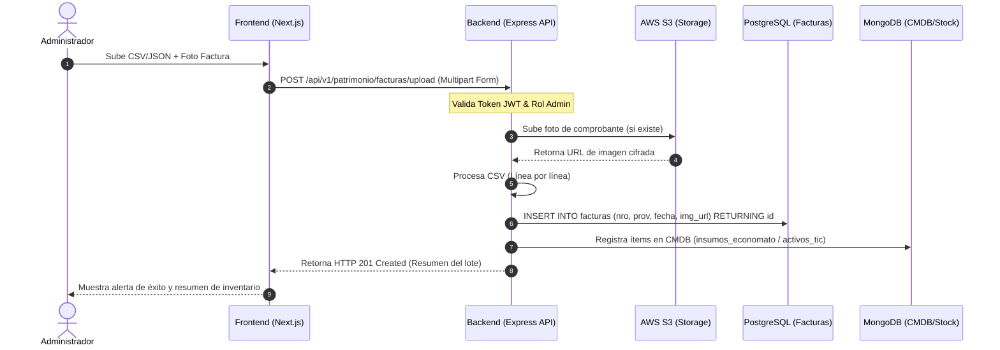
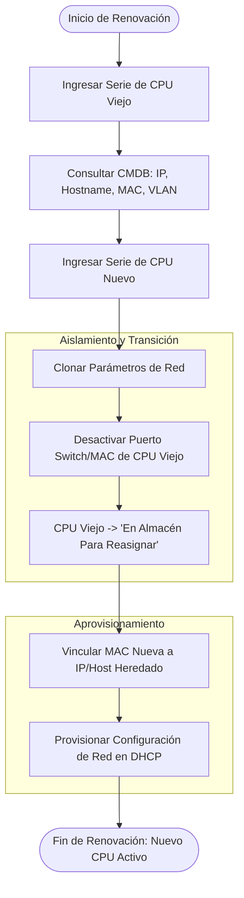
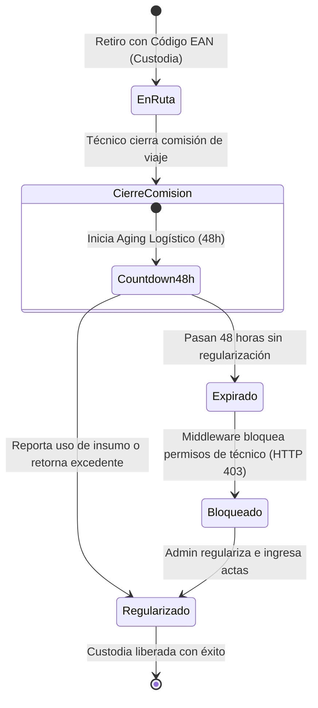

# Manual de Operación de Usuario de ENOCOMATIK y Guía de Despliegue de Infraestructura Cloud CI/CD

---

## 1. Guía del Administrador (Gestión Patrimonial)

La interfaz del **Administrador Patrimonial** (`rol: 'administrador'`) está diseñada para garantizar el cumplimiento normativo (Directrices de la Contraloría General de la República) y la continuidad de las operaciones lógicas de red durante los ciclos de vida de los activos tecnológicos.

---

### 1.1. Carga Masiva de Facturas por Lote (Ingreso de Activos)

El ingreso de nuevos lotes de repuestos y equipos se realiza a través del módulo de **Carga Masiva de Facturas**. Este proceso alimenta tanto la base transaccional de PostgreSQL como la CMDB dinámica en MongoDB Atlas.

#### Flujo de Operación en Interfaz (Paso a Paso)
1. **Acceso al Módulo:** Inicie sesión en la consola administrativa de ENOCOMATIK y diríjase al menú lateral izquierdo: **Gestión Patrimonial > Carga Masiva**.
2. **Preparación del Archivo de Lote:** Descargue la plantilla oficial en formato CSV o JSON. Complete las columnas obligatorias: `numero_factura`, `proveedor`, `fecha_emision`, `codigo_ean`, `nombre_item`, `cantidad` y `costo_unitario`.
3. **Carga del Archivo:** Arrastre y suelte el archivo en la zona de carga (Drag & Drop) identificada con el ID `invoice-bulk-upload-zone`.
4. **Adjuntar Comprobante (Foto Opcional):** Si cuenta con una foto o escaneo digital de la factura física, cárguela en la sección **Evidencia Digital** (formatos permitidos: `.jpg`, `.png`, `.pdf`; tamaño máximo: 5MB).
5. **Previsualización de Datos:** La interfaz renderizará una tabla interactiva con la validación sintáctica de los campos. Los registros con errores (por ejemplo, códigos EAN inválidos) se resaltarán en color ámbar.
6. **Confirmación y Envío:** Haga clic en **Procesar Lote**. Se iniciará el procesamiento asíncrono y se mostrará una barra de progreso en tiempo real.



#### Procesamiento en el Backend y Persistencia Híbrida
* **PostgreSQL (Transaccional):** Registra el encabezado y detalles financieros de la factura para auditorías fiscales.
* **MongoDB Atlas (CMDB Dinámica):** Actualiza el inventario físico agregando los modelos del hardware, números de serie y stock de repuestos (como rollers EAN) en documentos flexibles de la colección `insumos_economato`.

---

### 1.2. Renovación Tecnológica por Obsolescencia y Reemplazo de Equipos

Cuando un equipo de cómputo (CPU) es declarado obsoleto o sufre una falla irreparable en un área crítica (por ejemplo, Mesa de Partes Municipal), se debe ejecutar el proceso de **Renovación Tecnológica** para que el nuevo equipo herede los parámetros de red y no se paralice la atención ciudadana.



#### Paso a Paso para la Renovación Tecnológica en Consola:
1. Ingrese a **Gestión Patrimonial > Renovación de Equipos**.
2. En el buscador de **Equipo Saliente**, ingrese la dirección IP o el Número de Serie del CPU antiguo. El sistema jalará los datos de red de la base de datos híbrida.
3. En el campo **Equipo Entrante**, escanee o digite la serie del CPU nuevo que ha sido retirado del stock del Economato.
4. Presione el botón **Clonar Identidad de Red**. En este momento, el sistema realiza dos operaciones lógicas simultáneas:
   * **Aislamiento del CPU Viejo:** Deshabilita los permisos de red del hardware antiguo (limpia las entradas ARP/DHCP y actualiza su estado de red).
   * **Heredación de Parámetros:** El nuevo CPU hereda la dirección IP privada y el Hostname de forma automática.
5. Físicamente, el técnico conecta el nuevo CPU al punto de red del usuario final. El sistema envía la actualización a los servidores DHCP de la municipalidad.
6. El CPU viejo cambia su estado automáticamente a `'En Almacén (Para Reasignar)'`.

---

### 1.3. Emisión de Informes Técnicos: `INF-BAJA` vs. `INF-RENOV`

El Administrador Patrimonial es el único con facultades para autorizar la disposición final de los activos mediante la emisión de informes técnicos formalizados generados en formato Excel.

| Tipo de Informe | Caso de Uso | Impacto en Red | Destino Físico | Aprobación Requerida |
| :--- | :--- | :--- | :--- | :--- |
| **`INF-BAJA`** | Baja Definitiva. Equipos obsoletos, dañados por siniestro, o sin valor comercial que no pueden repararse. | **Liberación de IP instantánea:** La IP se reincorpora inmediatamente al pool dinámico para su reuso. | Chatarreo tecnológico / Disposición de residuos RAEE. | Directa del Administrador de TI y Logística. |
| **`INF-RENOV`** | Reutilización Ligera. Equipos con obsolescencia relativa que pueden funcionar en áreas de baja prioridad. | **Retención de IP temporal:** Se limpia la red y la IP se reasigna al nuevo equipo de reemplazo. | Acondicionamiento técnico y traslado a almacén/sedes secundarias. | Requiere aprobación formal del Administrador Patrimonial. |

#### Generación Técnica del Reporte con ExcelJS (Backend)
Los reportes se generan consultando PostgreSQL (NUNCA SQLite) mediante la librería de Node.js `exceljs` para cumplir con las directivas de auditoría.

```typescript
import { Request, Response } from 'express';
import Workbook from 'exceljs';
import { pool } from '../config/db'; // Conexión a PostgreSQL
import { logger } from '../utils/logger';

export const generateReporteMensual = async (req: Request, res: Response) => {
  try {
    const query = `
      SELECT id, codigo_informe, tipo_informe, activo_serie, creado_por, fecha_emision, justificacion
      FROM informes_baja_renovacion
      WHERE fecha_emision >= NOW() - INTERVAL '30 days'
      ORDER BY fecha_emision DESC
    `;
    const { rows } = await pool.query(query);

    const workbook = new Workbook.Workbook();
    const worksheet = workbook.addWorksheet('Informes del Mes');

    worksheet.columns = [
      { header: 'ID', key: 'id', width: 10 },
      { header: 'Código Informe', key: 'codigo_informe', width: 20 },
      { header: 'Tipo', key: 'tipo_informe', width: 15 },
      { header: 'Serie Activo', key: 'activo_serie', width: 25 },
      { header: 'Generado Por', key: 'creado_por', width: 20 },
      { header: 'Fecha Emisión', key: 'fecha_emision', width: 20 },
      { header: 'Justificación', key: 'justificacion', width: 40 }
    ];

    rows.forEach(row => {
      worksheet.addRow(row);
    });

    res.setHeader(
      'Content-Type',
      'application/vnd.openxmlformats-officedocument.spreadsheetml.sheet'
    );
    res.setHeader(
      'Content-Disposition',
      'attachment; filename=' + `Reporte_Mensual_Informes_${Date.now()}.xlsx`
    );

    await workbook.xlsx.write(res);
    res.end();
  } catch (error) {
    logger.error('Error al generar reporte de informes con exceljs:', error);
    res.status(500).json({ error: 'Error interno del servidor al generar el reporte' });
  }
};
```

---

## 2. Guía del Técnico (Soporte, Kanban y Economato)

La consola del **Técnico de Campo** (`rol: 'tecnico'`) está altamente optimizada para dispositivos móviles y terminales portátiles de inventario, permitiendo responder con celeridad en campo y zonas rurales sin cobertura constante.

---

### 2.1. Búsqueda Incremental y Switch de Contingencia Manual

#### Búsqueda Incremental de Activos por IP/Serie (Autocompletado Redis)
Para agilizar la atención de los tickets, el campo de búsqueda principal en la aplicación implementa autocompletado en tiempo real. 

* **Comportamiento UX:** Al digitar los primeros 3 caracteres de la IP o Número de Serie del CPU, el sistema realiza una consulta ultrarrápida a **Redis Cluster**.
* **Métrica de Rendimiento:** Las sugerencias se listan en menos de **5ms** gracias al almacenamiento en caché en Redis, con un tiempo de vida (TTL) de **60 segundos** para garantizar que los cambios recientes en la red se reflejen oportunamente.
* **Semáforo Crítico (PG):** Si la serie del activo ingresado registra **3 o más atenciones (tickets) previas** en PostgreSQL, la interfaz activa de forma inmediata un semáforo 🔴 crítico con un anuncio auditivo para lectores de pantalla mediante la directiva `aria-live="assertive"`.

```html
<!-- Componente React / Next.js de Alerta de Semáforo Crítico -->
<div 
  className="p-4 bg-red-100 border-l-4 border-red-600 text-red-900 rounded-r shadow-md flex items-center gap-3 animate-pulse"
  role="alert" 
  aria-live="assertive"
>
  <span className="text-2xl" aria-hidden="true">🔴</span>
  <div>
    <h4 className="font-bold text-red-950">¡Atención Crítica de Activo!</h4>
    <p className="text-sm">Este equipo registra 3 o más mantenimientos previos en la base de datos municipal.</p>
  </div>
</div>
```

---

#### Activación y Operación del Switch de Contingencia Manual
En escenarios de corte de conectividad con la red central de la municipalidad, o caída del enlace a las bases de datos transaccionales, el técnico puede activar manualmente el **Modo de Contingencia** mediante un switch físico/digital en la cabecera del Helpdesk.

```
┌─────────────────────────────────────────────────────────────┐
│  Módulo de Registro de Ticket               [ CONTINGENCIA ]│
│  🚨 Estado: Modo Contingencia Activo  (Conectividad Limitada)│
├─────────────────────────────────────────────────────────────┤
│  Serie Activo: [ CPU-98721-Muni  ] (Desbloqueado)           │
│  Detalle de Falla:                                          │
│  [ El scanner no enciende tras corte de energía eléc... ]   │
│                                                             │
│  [ GUARDAR EN MODO CONTINGENCIA ] (Cifra local / POST)       │
└─────────────────────────────────────────────────────────────┘
```

1. **Activación:** Deslice el interruptor **Modo de Contingencia** (`id="contingency-mode-switch"`).
2. **Efecto en Interfaz:** El sistema libera inmediatamente todos los inputs del formulario que solían estar bloqueados o condicionados a la validación en línea de red (como comprobaciones DNS, estado del switch IPAM o disponibilidad de stock en MongoDB).
3. **Persistencia Segura (Backend):** Cuando el técnico presiona "Guardar", el frontend envía los datos al backend. Como los sistemas de inventario no están disponibles, el backend **NO altera el stock físico** en MongoDB para evitar desajustes logísticos. En su lugar, el payload completo se cifra de forma simétrica utilizando **AES-256** y se almacena en el campo `datos_contingencia_cifrados` de PostgreSQL para su posterior regularización manual.

```typescript
// Cifrado simétrico de datos de contingencia en el Backend
import crypto from 'crypto';

const ALGORITHM = 'aes-256-cbc';
const ENCRYPTION_KEY = process.env.DB_ENCRYPTION_KEY; // Llave de 32 bytes

export const encryptContingencia = (data: string): { iv: string; encryptedData: string } => {
  const iv = crypto.randomBytes(16);
  const cipher = crypto.createCipheriv(ALGORITHM, Buffer.from(ENCRYPTION_KEY, 'hex'), iv);
  let encrypted = cipher.update(data);
  encrypted = Buffer.concat([encrypted, cipher.final()]);
  return {
    iv: iv.toString('hex'),
    encryptedData: encrypted.toString('hex')
  };
};
```

---

### 2.2. Autoasignación de Repuestos mediante Escaneo de Códigos EAN

Los técnicos de soporte que viajan a sedes remotas (comisiones de servicio de 7 a más días en agencias de provincia) autogestionan los repuestos de alta rotación (como rollers EAN de escáneres documentales) utilizando la cámara de su dispositivo móvil.

#### Proceso de Escaneo en Campo:
1. Abra la aplicación de ENOCOMATIK en el navegador de su teléfono móvil (conectado a la VPN de la municipalidad).
2. En el ticket asignado en su Kanban, presione el botón **Autoasignar Repuestos** (`id="btn-scan-ean"`).
3. Conceda permisos para el uso de la cámara trasera del dispositivo.
4. Apunte la cámara hacia el código de barras **EAN-13** pegado en el empaque del repuesto.
5. El sistema detecta el código, realiza la consulta correspondiente a MongoDB (`insumos_economato`) y descuenta de forma lógica **1 unidad** de las existencias generales.
6. El estado del insumo pasa inmediatamente a **`'En Ruta'`** (bajo custodia temporal del Técnico de Campo que inició la sesión).

```
  ┌──────────────────────────────────────────────────┐
  │ [ ] EAN-13: 7750123456789                        │
  │ Insumo: Kit de Rodillos de Tracción (Rollers)    │
  │ Estado de Custodia: 'En Ruta' (Asignado a: T-820)│
  └──────────────────────────────────────────────────┘
```

---

### 2.3. Liquidación de Custodia en Tránsito Post-Viaje (Aging Logístico)

Cuando un técnico retorna de una comisión de servicios en provincias, debe regularizar obligatoriamente el inventario de repuestos que retiró y quedaron marcados en estado **`'En Ruta'`**.



#### Panel de Acciones Rápidas para Liquidación:
1. Ingrese a su panel de control en **Mis Comisiones > Custodia Activa**.
2. Identifique los ítems marcados como `'En Ruta'`. El sistema mostrará un contador de cuenta regresiva en color naranja para el **Aging Logístico (48 horas)**.
3. Para cada repuesto, el técnico cuenta con dos acciones rápidas:
   * **Declarar Instalado:** Vincula el repuesto al ticket de soporte cerrado (el repuesto pasa a consumido y el ticket queda en estado `'Done'`).
   * **Devolver a Almacén:** Reincorpora físicamente el insumo al Economato Central (requiere firma digital de recepción del encargado).
4. **Consecuencia de Expiración:** Si la cuenta regresiva de 48 horas expira sin que el técnico haya liquidado los repuestos en custodia, el middleware del backend bloqueará de forma automática su cuenta para nuevos retiros de inventario, devolviendo un código `HTTP 403 Forbidden` en cualquier intento de autoasignación EAN posterior.

---

### 2.4. Flujo de Trabajo en el Tablero Kanban (Ayuda Visual)

El soporte de incidentes se gestiona mediante un tablero Kanban estricto que sigue los estados de negocio requeridos en el orden exacto del flujo operativo:

```
┌─────────────────┐     ┌─────────────────┐     ┌───────────────────────┐     ┌─────────────────┐
│     To Do       │ ──> │   In Progress   │ ──> │ En Tránsito a Taller  │ ──> │      Done       │
└─────────────────┘     └─────────────────┘     └───────────────────────┘     └─────────────────┘
  Registro inicial        Técnico evalúa          Equipo viaja al taller        Pruebas de control
  del ticket de fallo     y repara in-situ        principal para revisión       exitosas y cierre
```

---

## 3. Especificación de Despliegue y Orquestación Cloud (DevOps)

La infraestructura de ENOCOMATIK está diseñada bajo principios nativos de la nube, utilizando contenedores ligeros orquestados en Kubernetes sobre AWS y despliegues automáticos (CI/CD).

---

### 3.1. Pipeline de Integración y Despliegue Continuo (GitHub Actions)

El ciclo de desarrollo utiliza **GitHub Actions** configurado en el archivo [.github/workflows/ci-cd.yml](file:///d:/ECONOMATIK/.github/workflows/ci-cd.yml). El flujo se describe en las siguientes fases:

```
                  ┌──────────────────────────────────────────────┐
                  │ Push o Pull Request a 'main' / 'develop'     │
                  └──────────────────────┬───────────────────────┘
                                         │
                                         ▼
                  ┌──────────────────────────────────────────────┐
                  │ 1. Fase de Calidad y Pruebas (Test & Lint)   │
                  │    - Linting TypeScript                      │
                  │    - Pruebas Unitarias (Jest)                │
                  │    - Pruebas E2E (Cypress)                   │
                  └──────────────────────┬───────────────────────┘
                                         │ (Si es Exitoso y Rama Main)
                                         ▼
                  ┌──────────────────────────────────────────────┐
                  │ 2. Compilación y Publicación (Docker)        │
                  │    - Build Multi-Stage (Backend & Frontend)  │
                  │    - Envío de imágenes a AWS ECR             │
                  └──────────────────────┬───────────────────────┘
                                         │
                                         ▼
                  ┌──────────────────────────────────────────────┐
                  │ 3. Despliegue en AWS EKS (Kubernetes)        │
                  │    - Helm/Kubectl apply                      │
                  │    - Rolling Update sin tiempo de inactividad│
                  └──────────────────────────────────────────────┘
```

#### Pruebas Automatizadas del Pipeline
* **Cypress E2E:** Se ejecutan en un contenedor headless en la fase de control de calidad para validar los flujos de inicio de sesión OAuth2 y el tablero Kanban.
* **Jest Unit Tests:** Verifican los algoritmos de firma asimétrica de JWT y la encriptación AES-256 de los datos ingresados en modo contingencia.

---

### 3.2. Dockerización Multi-Stage de los Componentes

Para mantener los entornos de producción aislados y garantizar que el bundle final del frontend Next.js ocupe menos de **150KB gzip** en la carga inicial de JS, se implementan Dockerfiles multi-etapa.

#### Contenedor de Backend: `backend.Dockerfile`
Optimiza el peso final omitiendo el compilador de TypeScript y las dependencias de desarrollo.

```dockerfile
# Stage 1: Build Stage
FROM node:20-alpine AS builder
WORKDIR /app
COPY package*.json tsconfig.json ./
RUN npm ci
COPY src ./src
RUN npm run build

# Stage 2: Production Stage
FROM node:20-alpine AS runner
WORKDIR /app
ENV NODE_ENV=production
COPY package*.json ./
RUN npm ci --only=production
COPY --from=builder /app/dist ./dist
EXPOSE 4000
CMD ["node", "dist/server.js"]
```

#### Contenedor de Frontend: `frontend.Dockerfile`
Ejecuta la optimización y minificación de Next.js, inyectando estilos Tailwind purgados en el build.

```dockerfile
# Stage 1: Build Stage
FROM node:20-alpine AS builder
WORKDIR /app
COPY package*.json tsconfig.json tailwind.config.js postcss.config.js ./
RUN npm ci
COPY src ./src
ENV NEXT_TELEMETRY_DISABLED 1
RUN npm run build

# Stage 2: Production Stage
FROM node:20-alpine AS runner
WORKDIR /app
ENV NODE_ENV=production
ENV NEXT_TELEMETRY_DISABLED 1
COPY package*.json ./
RUN npm ci --only=production
COPY --from=builder /app/.next ./.next
COPY --from=builder /app/public ./public
COPY --from=builder /app/tsconfig.json ./tsconfig.json
EXPOSE 3000
CMD ["npx", "next", "start", "-p", "3000"]
```

---

### 3.3. Configuración y Orquestación en Kubernetes (AWS EKS)

El archivo de configuración principal de la malla de Kubernetes es [k8s-deployment.yaml](file:///d:/ECONOMATIK/devops/k8s-deployment.yaml). 

#### Estrategia de Despliegue Zero-Downtime (Rolling Update)
Para evitar la desconexión de los operadores del Helpdesk municipales durante las actualizaciones de software, se configura una política de actualización incremental sobre los Deployments del backend y frontend:

```yaml
spec:
  replicas: 3
  strategy:
    type: RollingUpdate
    rollingUpdate:
      maxSurge: 1       # Crea un pod nuevo temporal antes de destruir los antiguos
      maxUnavailable: 0 # Garantiza que el 100% de la capacidad de servicio esté activa
```

#### Ingress de Tráfico Municipal
El recurso `Ingress` expone la aplicación al exterior a través de la infraestructura de AWS (Application Load Balancer - ALB Controller), enrutando el tráfico de la siguiente manera:
* `/api` y `/graphql` son redirigidos al servicio interno de Express (`enocomatik-backend-service:4000`).
* `/` (raíz de navegación) es redirigida al portal en Next.js (`enocomatik-frontend-service:3000`).

---

### 3.4. Publicación Cloud: Producción vs. Previews de Ramas

#### Entorno de Producción: AWS EKS (Elastic Kubernetes Service)
* **Repositorio de Imágenes:** AWS ECR (Elastic Container Registry).
* **Base de Datos Relacional:** AWS RDS PostgreSQL configurado en modo Multi-AZ para alta disponibilidad transaccional.
* **Secretos de Aplicación:** Se inyectan en el Pod a través de objetos `ExternalSecrets` conectados a **AWS Secrets Manager**, garantizando que ninguna contraseña viaje en texto plano en los manifiestos de Kubernetes.

#### Previews de Ramas (Netlify)
Para acelerar la revisión del diseño frontend y de los criterios de accesibilidad en los Pull Requests (PRs), el pipeline integra despliegues temporales automatizados en **Netlify**:
* **Gatillador:** Cada creación de Pull Request orientado a las ramas `develop` o `main`.
* **Ruta de Preview:** Netlify genera una URL temporal única (por ejemplo, `deploy-preview-42--enocomatik.netlify.app`). Esto permite a los diseñadores UX y administradores validar los flujos visuales antes de que los cambios se compilen e incorporen al clúster Kubernetes de AWS.

---

### 3.5. Checklist del Repositorio Público (GitHub)

Para repositorios públicos que exponen el código base de ENOCOMATIK para contribuciones de otras administraciones locales:

- [ ] **README con Badges de Estado:**
  * Badge del pipeline de CI/CD de GitHub Actions (``).
  * Badge de cobertura de código con Jest (mínimo 85% de cobertura).
  * Badge de accesibilidad WCAG 2.1 AA aprobado.
- [ ] **Archivo de Licencia (`LICENSE`):**
  * Licencia de software libre o gubernamental permitida (por ejemplo, MIT o Apache 2.0) para fomentar la transparencia y el desarrollo colaborativo intermunicipal.
- [ ] **Guía de Contribución (`CONTRIBUTING.md`):**
  * Normas de estilo de código (ESLint, Prettier).
  * Configuración del entorno de desarrollo local con Docker Compose.
  * Flujo de trabajo git-flow (ramas `feature/`, `bugfix/` y pull requests contra la rama `develop`).
  * Manual de reporte de vulnerabilidades de seguridad.
