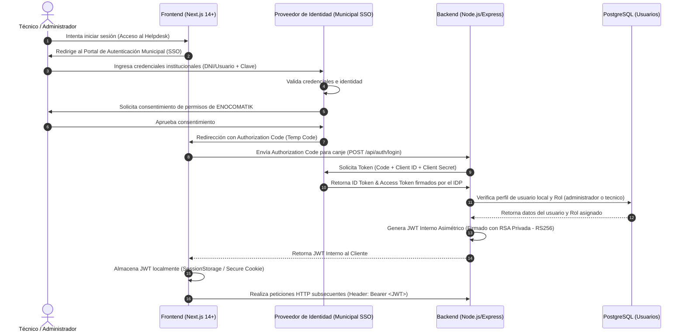
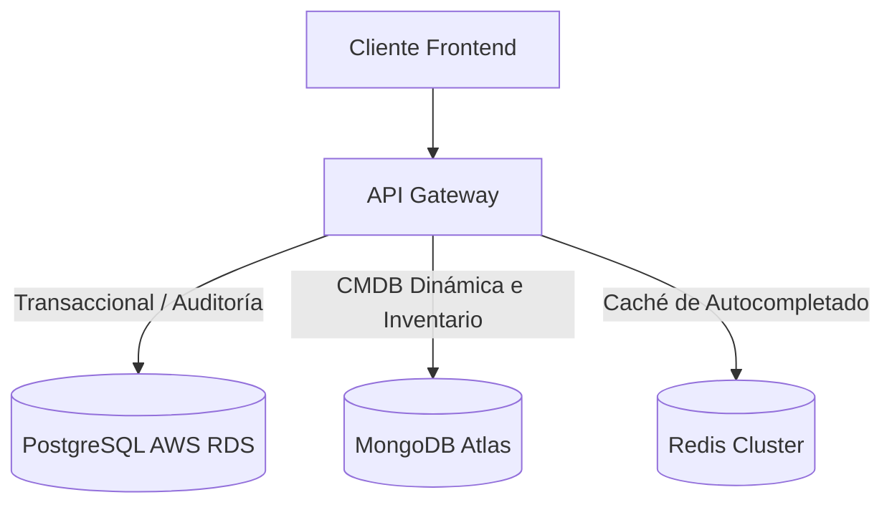
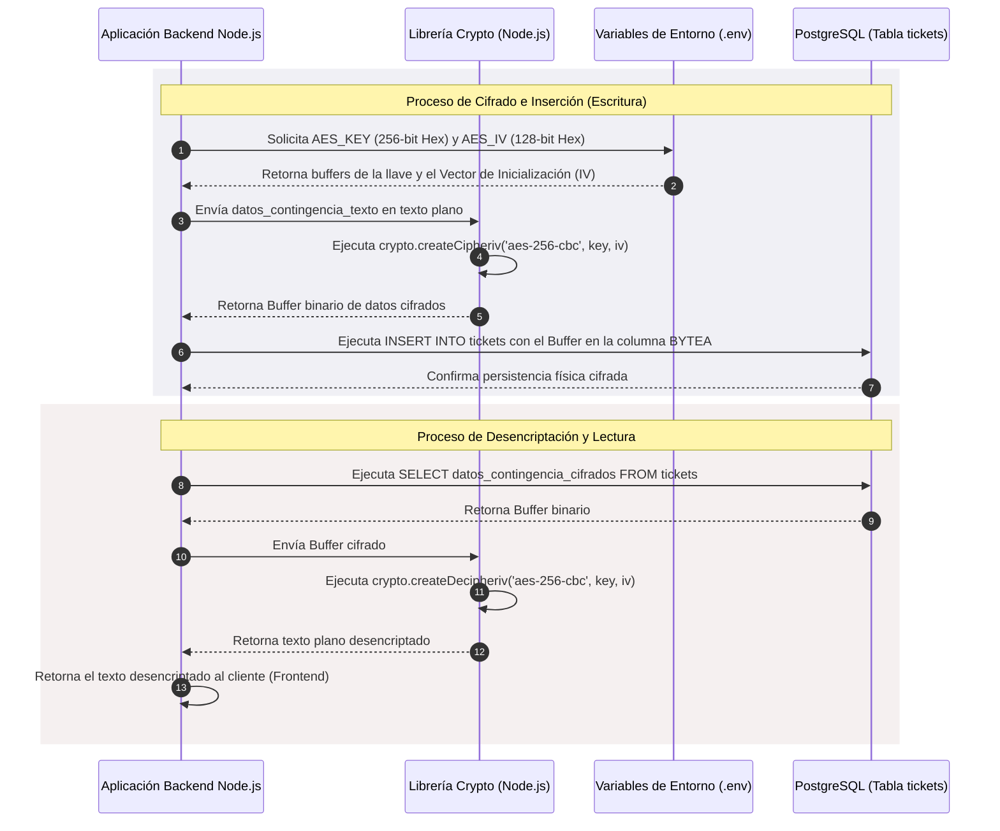
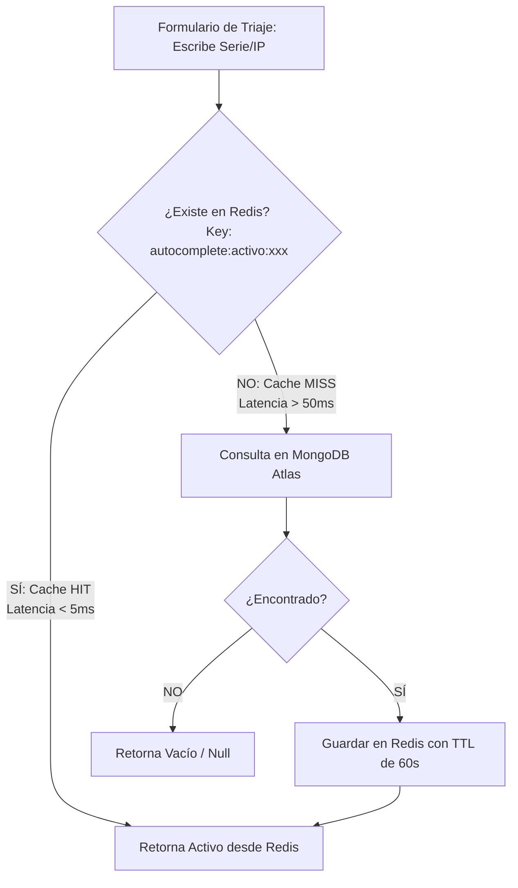
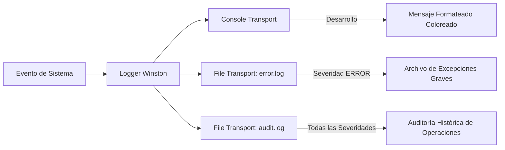

# Manual Técnico de Seguridad Informática, APIs (REST + GraphQL) y Gestión Híbrida de Datos de ENOCOMATIK

Este manual describe en detalle la infraestructura de seguridad, la gestión de la persistencia híbrida de datos, el diseño y uso de APIs (REST y GraphQL), y los sistemas de trazabilidad y auditoría implementados en **ENOCOMATIK**, la solución de microservicios para la gestión de activos de TI (ITIL v4) orientada a gobiernos locales y municipalidades descentralizadas.

---

## 1. Protocolo de Seguridad, Autenticación y Autorización

La seguridad de ENOCOMATIK se cimenta en un modelo híbrido de federación externa para la autenticación e intercambio de credenciales asimétricas internas para la autorización de operaciones en toda la malla de servicios.

### 1.1 Flujo de Autenticación OAuth2 (Authorization Code)

Para garantizar la interoperabilidad con los sistemas de identidad municipales (IDP Central de la Municipalidad, por ejemplo Keycloak o WSO2), la autenticación inicial se gestiona a través del flujo **OAuth2 con Código de Autorización (Authorization Code Grant)**.

#### Diagrama de Flujo del Protocolo de Autenticación



#### Detalle del Canje e Intercambio de Tokens
El Frontend de Next.js envía el código temporal al backend (`/api/auth/login`), el cual actúa como cliente confidencial de OAuth2 para intercambiar el código por el Token de Acceso del IDP. Una vez validada la identidad del usuario contra los registros de la municipalidad, el backend extrae el nombre de usuario (`username`) y realiza una consulta en la tabla `usuarios_sistema` de PostgreSQL para mapear su rol del sistema local (`administrador` o `tecnico`). 

---

### 1.2 Emisión y Estructura del JWT Interno Asimétrico (RS256)

Una vez confirmada la identidad del usuario, el backend emite un token de sesión de corto plazo firmado mediante criptografía asimétrica **RSA (algoritmo RS256)** con una duración de 24 horas.

#### Manejo y Carga de Llaves Asimétricas
El backend carga las llaves criptográficas desde variables de entorno codificadas en Base64 para prevenir la filtración de secretos en el código fuente:
- `JWT_PRIVATE_KEY_B64`: Llave privada RSA de 2048 bits en formato PKCS8 PEM codificada en Base64. Utilizada exclusivamente por el backend de autenticación para firmar los tokens.
- `JWT_PUBLIC_KEY_B64`: Llave pública RSA de 2048 bits en formato SPKI PEM codificada en Base64. Utilizada por los middlewares de la API y los servidores de GraphQL para validar la autenticidad del token sin requerir acceso a la llave privada.

> [!NOTE]
> En entornos de desarrollo locales o de contingencia, si estas variables no están presentes, el backend autogenera un par de llaves RSA temporales en memoria para garantizar que el servicio permanezca disponible.

#### Criptografía de Firma del JWT (RS256)
La firma asimétrica asegura el no-repudio: solo el backend (poseedor de la llave privada) puede emitir tokens válidos, mientras que cualquier componente o API Gateway dentro de la red municipal puede verificar su autenticidad utilizando la llave pública.

```typescript
// Firma de tokens usando la llave privada RSA
export const signToken = (payload: AuthUser): string => {
  return jwt.sign(payload, privateKeyPem, {
    algorithm: 'RS256',
    expiresIn: '24h',
  });
};

// Verificación de tokens usando la llave pública RSA
export const verifyToken = (token: string): AuthUser => {
  return jwt.verify(token, publicKeyPem, {
    algorithms: ['RS256'],
  }) as AuthUser;
};
```

---

### 1.3 Middlewares RBAC en Express (REST)

El control de acceso basado en roles (RBAC) en la capa REST se compone de dos middlewares concatenados a nivel de enrutador:
1. **`authenticateJWT`**: Extrae la cabecera `Authorization: Bearer <token>`, valida el token usando la llave pública RSA y acopla el payload decodificado al objeto `Request` bajo la propiedad `req.user`.
2. **`requireRole`**: Evalúa el rol del usuario autenticado contra un arreglo de roles permitidos para el endpoint solicitado. Si no hay coincidencia, deniega la petición con un código de estado `HTTP 403 Forbidden` y registra el incidente en el log de auditoría.

#### Implementación del Middleware de Control de Acceso (RBAC)

```typescript
import { Request, Response, NextFunction } from 'express';
import jwt from 'jsonwebtoken';
import { logger, getClientIp } from '../utils/logger';

export interface AuthUser {
  id: string;
  username: string;
  rol: 'administrador' | 'tecnico';
}

export interface AuthenticatedRequest extends Request {
  user?: AuthUser;
}

export const authenticateJWT = (req: AuthenticatedRequest, res: Response, next: NextFunction) => {
  const authHeader = req.headers.authorization;
  const ip = getClientIp(req);

  if (!authHeader || !authHeader.startsWith('Bearer ')) {
    logger.warn('Intento de acceso sin cabecera de autenticación válida.', { remote_addr: ip });
    return res.status(401).json({ message: 'Acceso no autorizado: Token faltante' });
  }

  const token = authHeader.split(' ')[1];
  try {
    const decoded = verifyToken(token); // Valida firma RS256 con llave pública
    req.user = decoded;
    next();
  } catch (error: any) {
    logger.error('Fallo en la validación del token JWT.', { remote_addr: ip, error: error.message });
    return res.status(401).json({ message: 'Acceso no autorizado: Token inválido o expirado' });
  }
};

export const requireRole = (allowedRoles: ('administrador' | 'tecnico')[]) => {
  return (req: AuthenticatedRequest, res: Response, next: NextFunction) => {
    const ip = getClientIp(req);
    
    if (!req.user) {
      logger.warn('Acceso denegado: Middleware de roles invocado antes de la autenticación.', { remote_addr: ip });
      return res.status(401).json({ message: 'No autenticado' });
    }

    if (!allowedRoles.includes(req.user.rol)) {
      logger.warn(`Acceso prohibido: Usuario ${req.user.username} con rol ${req.user.rol} intentó acceder a recurso restringido.`, {
        remote_addr: ip,
        required_roles: allowedRoles,
      });
      return res.status(403).json({ message: 'Acceso denegado: Permisos insuficientes' });
    }

    next();
  };
};
```

---

### 1.4 Equivalencia de Seguridad en GraphQL

En el servidor GraphQL (Apollo Server), la seguridad se aplica de forma paralela a través de la inyección de contexto de autenticación y la validación a nivel de resolvers.

#### Inyección del Contexto de Autenticación
Durante la inicialización del servidor Apollo, se intercepta la petición HTTP entrante, se lee el encabezado `Authorization`, se verifica el token y se inyecta la información del usuario (`Context.user`) y su dirección IP de origen en el contexto compartido de GraphQL.

```typescript
const server = new ApolloServer({
  typeDefs,
  resolvers,
  context: ({ req }) => {
    const authHeader = req.headers.authorization || '';
    const remoteIp = getClientIp(req);
    let user: AuthUser | undefined;

    if (authHeader.startsWith('Bearer ')) {
      const token = authHeader.split(' ')[1];
      try {
        user = verifyToken(token);
      } catch (err) {
        // Se permite que la petición prosiga al contexto, pero sin usuario
        // de modo que las consultas públicas puedan resolverse
      }
    }
    return { user, remoteIp };
  },
});
```

#### Autorización Basada en Directivas de Esquema (`@auth`)
Para replicar el comportamiento de RBAC en el esquema GraphQL de forma declarativa, se utiliza la directiva personalizada `@auth`. Esto permite documentar y restringir los tipos, campos, queries y mutaciones directamente en el esquema SDL:

```graphql
directive @auth(role: Rol!) on FIELD_DEFINITION

enum Rol {
  administrador
  tecnico
}

type Mutation {
  crearInformeBaja(
    numero_informe: String!
    diagnostico_tecnico: String!
    sustento_logistico: String!
    serie_activo: String!
  ): Boolean! @auth(role: administrador)

  aprobarReutilizacion(
    serie_activo: String!
  ): Boolean! @auth(role: administrador)
}
```

#### Verificación en Resolvers (Fallback de Seguridad)
Como medida de seguridad defensiva, cada resolver de GraphQL que requiera roles específicos contiene verificaciones de seguridad explícitas internas para evitar accesos indebidos si las directivas del esquema son omitidas durante refactorizaciones de código:

```typescript
crearInformeBaja: async (
  _parent: any,
  args: { numero_informe: string; diagnostico_tecnico: string; sustento_logistico: string; serie_activo: string },
  context: Context
) => {
  // Verificación imperativa de seguridad
  if (!context.user || context.user.rol !== 'administrador') {
    logger.warn(`Intento de mutación no autorizada crearInformeBaja.`, { remote_addr: context.remoteIp });
    throw new Error('Solo el administrador patrimonial puede emitir informes de baja.');
  }
  
  // Lógica transaccional de base de datos...
}
```

---

## 2. Mapa y Diccionario de Datos Híbrido

ENOCOMATIK emplea una arquitectura de bases de datos híbrida (Polyglot Persistence) para optimizar el rendimiento y adaptarse a la naturaleza de cada conjunto de datos.



- **PostgreSQL**: Datos transaccionales estructurados con integridad referencial (usuarios, tickets de atención, informes formales firmados, registro de custodia y penalizaciones).
- **MongoDB**: Catálogo dinámico y extensible de hardware informático (CMDB) y stock de repuestos de alta rotación (economato), caracterizados por esquemas variables de acuerdo a la categoría de hardware.
- **Redis**: Capa de caché de muy baja latencia (<5ms) para el autocompletado interactivo de números de serie y direcciones IP en el triaje inbound.

---

### 2.1 Diccionario de Datos Tabular de PostgreSQL

#### Tabla: `usuarios_sistema`
Almacena el registro oficial de cuentas internas de técnicos y administradores habilitados para acceder a la plataforma.

| Campo | Tipo de Datos | Restricciones | Descripción |
| :--- | :--- | :--- | :--- |
| `id` | `UUID` | `PRIMARY KEY`, `DEFAULT gen_random_uuid()` | Identificador único global de la cuenta del usuario. |
| `username` | `VARCHAR(100)` | `UNIQUE`, `NOT NULL` | Nombre de usuario de red institucional (SSO). |
| `password_hash` | `VARCHAR(255)` | `NOT NULL` | Hash de la contraseña del usuario (cifrado con `bcryptjs`, 10 rondas de sal). |
| `rol` | `VARCHAR(20)` | `NOT NULL`, `CHECK (rol IN ('administrador', 'tecnico'))` | Rol asignado dentro del sistema que determina los permisos RBAC. |

#### Tabla: `tickets`
Almacena el registro histórico de atenciones de soporte técnico levantados por mal funcionamiento de hardware.

| Campo | Tipo de Datos | Restricciones | Descripción |
| :--- | :--- | :--- | :--- |
| `id` | `UUID` | `PRIMARY KEY`, `DEFAULT gen_random_uuid()` | Identificador único del ticket. |
| `key` | `VARCHAR(50)` | `UNIQUE`, `NOT NULL`, `DEFAULT ('HD-' \|\| nextval('ticket_key_seq'))` | Clave incremental legible para mesa de ayuda (ej. `HD-1001`). |
| `canal_origen` | `VARCHAR(20)` | `NOT NULL`, `CHECK (canal_origen IN ('Llamada', 'Plataforma'))` | Canal por el cual se reportó la incidencia. |
| `resumen` | `VARCHAR(255)` | `NOT NULL` | Título sintético del problema reportado. |
| `sintoma_descripcion` | `TEXT` | `NOT NULL` | Detalle exhaustivo del problema o falla reportada. |
| `status` | `VARCHAR(30)` | `NOT NULL`, `CHECK (status IN ('To Do', 'In Progress', 'En Tránsito a Taller', 'Done'))` | Ciclo de vida estricto del ticket en el tablero Kanban. |
| `prioridad` | `VARCHAR(20)` | `NOT NULL`, `CHECK (prioridad IN ('Baja', 'Media', 'Alta'))` | Prioridad operativa de la atención. |
| `registro_manual_contingencia` | `BOOLEAN` | `DEFAULT FALSE` | Flag que indica si el ticket fue creado bajo modo de contingencia. |
| `datos_contingencia_cifrados` | `BYTEA` | `DEFAULT NULL` | Datos en texto plano del ticket cifrados con **AES-256-CBC** para persistencia protegida. |
| `tecnico_id` | `UUID` | `FOREIGN KEY` referencias `usuarios_sistema(id)` | Técnico asignado para la resolución de la incidencia. |
| `agencia_id` | `VARCHAR(100)` | `NOT NULL` | Identificador de la agencia municipal de origen del hardware. |
| `serie_activo` | `VARCHAR(100)` | `DEFAULT NULL` | Referencia física al número de serie del activo afectado en la CMDB. |
| `fecha_creacion` | `TIMESTAMP` | `DEFAULT CURRENT_TIMESTAMP` | Fecha y hora de apertura del ticket. |

#### Tabla: `informes_baja_renovacion`
Almacena los informes técnicos formales que justifican el fin del ciclo de vida útil del hardware.

| Campo | Tipo de Datos | Restricciones | Descripción |
| :--- | :--- | :--- | :--- |
| `id` | `UUID` | `PRIMARY KEY`, `DEFAULT gen_random_uuid()` | Identificador único del informe. |
| `numero_informe` | `VARCHAR(50)` | `UNIQUE`, `NOT NULL` | Código oficial del informe (`INF-BAJA-XXXX` o `INF-RENOV-XXXX`). |
| `tipo` | `VARCHAR(20)` | `NOT NULL`, `CHECK (tipo IN ('Baja', 'Renovacion'))` | Tipo de movimiento: `Baja` (Definitiva) o `Renovacion` (Reasignación ligera). |
| `diagnostico_tecnico` | `TEXT` | `NOT NULL` | Justificación técnica de la degradación del equipo. |
| `sustento_logistico` | `TEXT` | `NOT NULL` | Detalle del impacto administrativo y justificación de la renovación. |
| `administrador_id` | `UUID` | `FOREIGN KEY` referencias `usuarios_sistema(id)` | Administrador patrimonial que valida y emite el documento de baja/renovación. |
| `fecha_creacion` | `TIMESTAMP` | `DEFAULT CURRENT_TIMESTAMP` | Fecha de generación y firma del reporte. |

#### Tabla: `custodia_repuestos`
Almacena la trazabilidad de insumos y repuestos físicos retirados por técnicos de campo para comisiones de viaje a provincias lejanas.

| Campo | Tipo de Datos | Restricciones | Descripción |
| :--- | :--- | :--- | :--- |
| `id` | `UUID` | `PRIMARY KEY`, `DEFAULT gen_random_uuid()` | Identificador único del registro de custodia. |
| `tecnico_id` | `UUID` | `NOT NULL`, `FOREIGN KEY` referencias `usuarios_sistema(id)` | Técnico custodio responsable de los materiales retirados. |
| `ean_codigo` | `VARCHAR(50)` | `NOT NULL` | Código de barras estándar de alta rotación (EAN) del repuesto. |
| `estado` | `VARCHAR(20)` | `NOT NULL`, `CHECK (estado IN ('En Ruta', 'Consumido', 'Devuelto'))` | Estado de la custodia: `En Ruta` (en viaje), `Consumido` o `Devuelto` al almacén. |
| `fecha_retiro` | `TIMESTAMP` | `DEFAULT CURRENT_TIMESTAMP` | Fecha de retiro físico del almacén. |
| `fecha_cierre_comision` | `TIMESTAMP` | `NULL` | Fecha en la que culmina el viaje del técnico a agencias externas. |
| `fecha_regularizacion` | `TIMESTAMP` | `NULL` | Fecha de rendición definitiva del repuesto (Consumo o Devolución). |
| `comision_activa` | `BOOLEAN` | `DEFAULT TRUE` | Indica si el técnico se encuentra actualmente en comisión de viaje con este repuesto. |

---

### 2.2 Mecanismo de Cifrado AES-256-CBC para Modo de Contingencia

Cuando el sistema entra en **modo de contingencia** (por ejemplo, debido a la caída de los enlaces de red de la CMDB centralizada o falla de conectividad de servicios clave), se liberan temporalmente los bloqueos de inputs de serie e IP en el frontend para no paralizar el servicio al ciudadano. Sin embargo, para evitar el almacenamiento de datos en texto plano y cumplir con la regulación gubernamental de protección de datos, toda información ingresada de forma manual en este modo es cifrada simétricamente mediante **AES-256-CBC** antes de ser escrita en el campo `datos_contingencia_cifrados` de tipo `BYTEA` en PostgreSQL.

#### Diagrama de Secuencia de Cifrado y Desencriptado AES-256



#### Código del Mecanismo Criptográfico (`crypto.ts`)
```typescript
import crypto from 'crypto';
import dotenv from 'dotenv';

dotenv.config();

// Carga de la clave simétrica y vector de inicialización desde variables de entorno
const AES_KEY_HEX = process.env.AES_KEY || '603deb1015ca71be2b73aef0857d77811f352c073b6108d72d9810a30914df1a';
const AES_IV_HEX = process.env.AES_IV || '2b7e151628aed2a6abf7158809cf4f3c';

const key = Buffer.from(AES_KEY_HEX, 'hex');
const iv = Buffer.from(AES_IV_HEX, 'hex');
const algorithm = 'aes-256-cbc';

/**
 * Encripta un string de texto plano usando AES-256-CBC y devuelve un Buffer binario.
 */
export const encryptAES = (text: string): Buffer => {
  try {
    const cipher = crypto.createCipheriv(algorithm, key, iv);
    let encrypted = cipher.update(text, 'utf8');
    encrypted = Buffer.concat([encrypted, cipher.final()]);
    return encrypted;
  } catch (error) {
    console.error('Error durante la encriptación AES:', error);
    throw new Error('Fallo crítico al encriptar datos.');
  }
};

/**
 * Desencripta un Buffer binario recuperado de PostgreSQL usando AES-256-CBC y devuelve el texto original.
 */
export const decryptAES = (buffer: Buffer): string => {
  try {
    const decipher = crypto.createDecipheriv(algorithm, key, iv);
    let decrypted = decipher.update(buffer);
    decrypted = Buffer.concat([decrypted, decipher.final()]);
    return decrypted.toString('utf8');
  } catch (error) {
    console.error('Error durante la desencriptación AES:', error);
    throw new Error('Fallo crítico al desencriptar datos.');
  }
};
```

---

### 2.3 Estructura del Esquema JSON Flexible de MongoDB Atlas

MongoDB se utiliza como almacén de documentos flexibles y dinámicos para los modelos de datos de la CMDB de infraestructura municipal e inventarios físicos de consumibles.

#### Colección: `activos_tic` (Esquema de Activo de Red)
Almacena el registro dinámico de la configuración de red y datos de asignación de hardware. Cuenta con una referencia autorreferencial `activo_reemplazado_id` para enlazar un activo a su predecesor en renovaciones de hardware.

```json
{
  "$schema": "http://json-schema.org/draft-07/schema#",
  "title": "ActivoTIC",
  "type": "object",
  "properties": {
    "_id": {
      "type": "string",
      "description": "ID auto-generado por MongoDB"
    },
    "numero_serie": {
      "type": "string",
      "description": "Número de serie física del fabricante (Indexado, Único)"
    },
    "tipo_equipo": {
      "type": "string",
      "description": "Categoría de hardware (ej: CPU, Impresora, Switch)"
    },
    "marca": {
      "type": "string",
      "description": "Fabricante del hardware"
    },
    "modelo": {
      "type": "string",
      "description": "Modelo del fabricante"
    },
    "ip_asignada": {
      "type": [
        "string",
        "null"
      ],
      "description": "IP institucional asignada en la VPN municipal"
    },
    "nombre_estacion": {
      "type": "string",
      "description": "Nombre de Host/Estación de red asignado"
    },
    "usuario_red_asignado": {
      "type": "string",
      "description": "Nombre de usuario LDAP/Active Directory del funcionario"
    },
    "nombre_usuario_final": {
      "type": "string",
      "description": "Nombre y apellidos completos del funcionario público usuario"
    },
    "fecha_registro_sistema": {
      "type": "string",
      "format": "date-time",
      "description": "Fecha y hora de alta en la CMDB"
    },
    "ubicacion_agencia": {
      "type": "string",
      "description": "Ubicación o agencia municipal donde opera el equipo"
    },
    "activo_reemplazado_id": {
      "type": [
        "string",
        "null"
      ],
      "description": "Número de serie del activo anterior reemplazado (Referencia Histórica)"
    }
  },
  "required": [
    "numero_serie",
    "tipo_equipo",
    "marca",
    "modelo",
    "nombre_estacion",
    "usuario_red_asignado",
    "nombre_usuario_final",
    "ubicacion_agencia"
  ]
}
```

#### Colección: `insumos_economato` (Esquema de Repuestos e Insumos)
Almacena el catálogo y stock actual de repuestos e insumos disponibles en el almacén de economato central.

```json
{
  "$schema": "http://json-schema.org/draft-07/schema#",
  "title": "InsumoEconomato",
  "type": "object",
  "properties": {
    "_id": {
      "type": "string"
    },
    "sku_codigo": {
      "type": "string",
      "description": "Código interno SKU de catalogación patrimonial (Indexado, Único)"
    },
    "ean_codigo": {
      "type": "string",
      "description": "Código de barras universal EAN para escaneo rápido de almacén (Indexado, Único)"
    },
    "descripcion_articulo": {
      "type": "string",
      "description": "Descripción formal del artículo"
    },
    "categoria": {
      "type": "string",
      "enum": [
        "Repuesto",
        "Insumo"
      ],
      "description": "Clasificación de economato"
    },
    "cantidad_stock": {
      "type": "integer",
      "minimum": 0,
      "description": "Cantidad de unidades físicas disponibles"
    },
    "unidad_medida": {
      "type": "string",
      "description": "Unidad de embalaje (ej: Unidades, Metros, Cajas)"
    }
  },
  "required": [
    "sku_codigo",
    "ean_codigo",
    "descripcion_articulo",
    "categoria",
    "cantidad_stock",
    "unidad_medida"
  ]
}
```

---

### 2.4 Directiva TTL en Redis para Caché de Autocompletado

Para mitigar la carga de consultas masivas concurrentes en la base de datos de MongoDB Atlas y proveer tiempos de respuesta de autocompletado menores a **5ms** durante la digitación rápida en el triaje, se emplea un clúster de Redis en memoria.

#### Flujo de Consulta con Redis Cache (Read-Through Cache Pattern)



#### Estructura del Key y Directiva TTL
- **Formato del Key**: `autocomplete:activo:<query_en_minusculas>`
- **Comando de Almacenamiento**: `SETEX` (Set con expiración atómica en segundos).
- **Tiempo de Vida (TTL)**: **60 segundos** (`TTL 60`). Este valor garantiza que si un administrador modifica datos de red o asignación de un activo en la CMDB, la información desactualizada de la búsqueda predictiva persistirá como máximo 60 segundos antes de expirar y volver a cargarse directamente desde MongoDB.
- **Formato de datos almacenados**: Estructuras serializadas en formato JSON String.

#### Fragmento de Implementación en Resolvers
```typescript
const redisKey = `autocomplete:activo:${query.toLowerCase()}`;
try {
  // 1. Intentar recuperación desde la caché de Redis
  const cached = await redisClient.get(redisKey);
  if (cached) {
    logger.info(`Búsqueda de activo cacheada (Redis HIT): ${query}`);
    return JSON.parse(cached);
  }

  // 2. Fallback a MongoDB Atlas si no se encuentra en caché
  const activo = await ActivoTIC.findOne({
    $or: [
      { numero_serie: { $regex: query, $options: 'i' } },
      { ip_asignada: { $regex: query, $options: 'i' } },
    ],
  });

  if (activo) {
    // 3. Almacenar en Redis aplicando la directiva TTL de 60 segundos de forma atómica
    await redisClient.setex(redisKey, 60, JSON.stringify(activo));
    logger.info(`Búsqueda de activo en DB (Redis MISS, Cacheado): ${query}`);
    return activo;
  }
} catch (err: any) {
  logger.error('Error en búsqueda de activo en Redis/MongoDB:', { error: err.message });
}
```

---

## 3. API REST vs GraphQL — Criterio de Uso

ENOCOMATIK implementa un enfoque de integración híbrido, aprovechando las fortalezas del protocolo REST para la transferencia masiva de archivos y operaciones binarias, y GraphQL para la interactividad reactiva en tiempo real del frontend.

### 3.1 Criterio de Decisión Arquitectónica

| Característica / Criterio | API REST (HTTP endpoints) | GraphQL (Apollo Server) |
| :--- | :--- | :--- |
| **Casos de Uso Principales** | Autenticación inicial, subida masiva de datos (lotes pesados), descarga de binarios generados en el servidor (como hojas Excel). | Interacciones fluidas de UI, vistas maestras de tickets, control de estados de incidencias (Kanban), paneles de administración y CMDB dinámica. |
| **Volumen de Transferencia** | Adecuado para payloads estructurados estáticos y streams de archivos grandes. | Optimizado para reducir el tamaño del payload solicitando únicamente las propiedades necesarias. |
| **Gestión de Recursos** | Orientada al procesamiento del servidor (ej. generación en streaming de reportes mediante la biblioteca `exceljs`). | Orientada a la composición de vistas y agregación rápida de datos relacionales y no relacionales. |
| **Acoplamiento cliente/servidor**| Fuerte: los endpoints definen estructuras fijas de salida en formato JSON. | Débil: el cliente determina de forma flexible la estructura del JSON de retorno mediante el cuerpo del query. |

---

### 3.2 Tabla Comparativa de Endpoints

La siguiente tabla describe la correspondencia lógica entre los endpoints REST de la aplicación y sus consultas y mutaciones equivalentes expuestas en el esquema GraphQL.

| Tipo | Método / Operación | Endpoint / Query-Mutation | Roles Permitidos | Propósito Técnico |
| :--- | :--- | :--- | :--- | :--- |
| **REST** | `POST` | `/api/auth/login` | Público | Autenticación contra credenciales cifradas y emisión de tokens. |
| **REST** | `GET` | `/api/reports/download` | `administrador`, `tecnico` | Genera y transmite en stream un reporte `.xlsx` usando `exceljs` desde PostgreSQL. |
| **REST** | `POST` | `/api/assets/bulk-upload` | `administrador` | Procesa inserciones masivas (upserts) de hardware en la colección MongoDB. |
| **GraphQL** | `Query` | `me` | `administrador`, `tecnico` | Retorna los detalles de sesión de la cuenta activa. |
| **GraphQL** | `Query` | `searchActivo(query: String!)` | `administrador`, `tecnico` | Retorna sugerencias de autocompletado en triaje con caché en Redis. |
| **GraphQL** | `Query` | `checkHistorialActivo(serie: String!)` | `administrador`, `tecnico` | Comprueba si una serie tiene 3+ atenciones anteriores (alerta roja). |
| **GraphQL** | `Query` | `checkAgingLogistico(tecnicoId: String!)` | `administrador`, `tecnico` | Valida si un técnico excede el plazo de 48h de rendición de comisiones. |
| **GraphQL** | `Mutation` | `createTicket(...)` | `administrador`, `tecnico` | Crea un ticket de atención (soporta cifrado AES en contingencia). |
| **GraphQL** | `Mutation` | `updateTicketStatus(...)` | `administrador`, `tecnico` | Actualiza la fase del ticket en el tablero Kanban. |
| **GraphQL** | `Mutation` | `abrirComisionViaje(...)` | `tecnico` | Retira repuestos EAN de inventario y los pone en tránsito. |
| **GraphQL** | `Mutation` | `cerrarComisionViaje(...)` | `tecnico` | Finaliza la comisión del viaje e inicia el conteo de 48 horas. |
| **GraphQL** | `Mutation` | `renovacionTecnologica(...)` | `administrador`, `tecnico` | Realiza el traspaso de direccionamiento IP y host a nuevo hardware. |
| **GraphQL** | `Mutation` | `crearInformeBaja(...)` | `administrador` | Registra el informe `INF-BAJA` y libera la IP inmediatamente en MongoDB. |

---

### 3.3 Ejemplos de Esquemas y Payloads de Integración

#### Ejemplo 1: Mutación GraphQL para Creación de Ticket (`createTicket`)

Esta mutación permite al técnico o administrador registrar una incidencia. Si el flag `registro_manual_contingencia` se define en `true`, la descripción en texto plano se cifra internamente en PostgreSQL.

##### Definición del Query de Envío (GraphQL Client)
```graphql
mutation RegistrarIncidencia(
  $canal: String!
  $resumen: String!
  $sintoma: String!
  $prioridad: String!
  $agencia: String!
  $serie: String
  $contingencia: Boolean!
  $textoContingencia: String
) {
  createTicket(
    canal_origen: $canal
    resumen: $resumen
    sintoma_descripcion: $sintoma
    prioridad: $prioridad
    agencia_id: $agencia
    serie_activo: $serie
    registro_manual_contingencia: $contingencia
    datos_contingencia_texto: $textoContingencia
  ) {
    id
    key
    status
    registro_manual_contingencia
    datos_contingencia_cifrados
    fecha_creacion
  }
}
```

##### Variables de la Petición (JSON Payload) - Caso Contingencia Activo
```json
{
  "canal": "Llamada",
  "resumen": "Falla de encendido CPU Oficina Rentas",
  "sintoma": "Equipo no enciende tras tormenta eléctrica y corte de energía.",
  "prioridad": "Alta",
  "agencia": "Agencia Municipal de Rentas",
  "serie": null,
  "contingencia": true,
  "textoContingencia": "Dirección IP original: 10.15.2.45. Hostname: MUNI-RENTAS-02. Falla en placa madre detectada visualmente."
}
```

##### Respuesta Retornada por la API GraphQL (JSON Output)
El backend devuelve los datos insertados, mostrando la desencriptación en caliente para la sesión del usuario autenticado:
```json
{
  "data": {
    "createTicket": {
      "id": "c1f71df4-ec73-4554-b461-1250325dbb15",
      "key": "HD-1008",
      "status": "To Do",
      "registro_manual_contingencia": true,
      "datos_contingencia_cifrados": "Dirección IP original: 10.15.2.45. Hostname: MUNI-RENTAS-02. Falla en placa madre detectada visualmente.",
      "fecha_creacion": "2026-07-08T18:32:00.000Z"
    }
  }
}
```

#### Ejemplo 2: Payload de Carga Masiva de Activos (REST API - `POST /api/assets/bulk-upload`)

Este endpoint maneja lotes de datos estructurados para inicializar la CMDB de hardware a través de un arreglo JSON enviado por administradores de TI.

##### Request Headers
```http
POST /api/assets/bulk-upload HTTP/1.1
Host: api.enocomatik.gob.pe
Authorization: Bearer <JWT_INTERNAL_RS256>
Content-Type: application/json
```

##### Request Body (JSON Array)
```json
[
  {
    "numero_serie": "SERIE-CPU-2026A",
    "tipo_equipo": "CPU",
    "marca": "Dell",
    "modelo": "OptiPlex 7090",
    "ip_asignada": "10.10.40.12",
    "nombre_estacion": "MUNI-TESORERIA-01",
    "usuario_red_asignado": "lrodriguez",
    "nombre_usuario_final": "Luis Rodríguez",
    "ubicacion_agencia": "Agencia Central - Tesorería"
  },
  {
    "numero_serie": "SERIE-PRN-2026B",
    "tipo_equipo": "Impresora",
    "marca": "HP",
    "modelo": "LaserJet Pro M404dn",
    "ip_asignada": "10.10.40.85",
    "nombre_estacion": "MUNI-TESORERIA-PRN",
    "usuario_red_asignado": "system",
    "nombre_usuario_final": "Uso Compartido",
    "ubicacion_agencia": "Agencia Central - Tesorería"
  }
]
```

##### Response Body (HTTP 200 OK)
```json
{
  "message": "Carga masiva procesada con éxito.",
  "processed_count": 2
}
```

---

## 4. Trazabilidad y Logging Centralizado contra Desastres

El logging robusto y centralizado de auditoría en ENOCOMATIK es crítico para asegurar la trazabilidad del estado del sistema en caso de desastres lógicos u operativos y para auditorías requeridas por los entes de control gubernamentales.

### 4.1 Configuración Estructurada del Logger de Winston

El backend utiliza **Winston** como motor principal de registro estructurado en formato JSON. Esta estructuración permite que herramientas de análisis y monitoreo (como AWS CloudWatch, Datadog o Elastic Stack) indexen los campos semánticos de forma nativa sin requerir expresiones regulares de parseo complejas.

#### Campos Críticos en los Metadatos del Log
Para garantizar el rastreo completo de una transacción sospechosa o un incidente, cada línea de registro inyecta de forma obligatoria los siguientes metadatos:
- **`timestamp`**: Fecha y hora exacta de la transacción en formato ISO-8601 local (`YYYY-MM-DD HH:mm:ss`).
- **`level`**: Severidad de la traza (coloreado en consola: `info`, `warn`, `error`).
- **`remote_addr`**: Dirección IP de origen del cliente, resolviendo proxies inversos a través de la cabecera `X-Forwarded-For` para identificar la terminal de la VPN municipal desde donde se ejecutó la acción.
- **`userId` / `username`**: Identificadores únicos de la cuenta activa que realiza la petición (extraídos del token JWT decodificado).
- **`rol`**: Rol del usuario (`administrador` o `tecnico`) para auditorías de permisos.
- **`httpMethod` / `endpoint` / `operationName`**: Detalles específicos del canal API consumido para correlación de transacciones.

---

### 4.2 Destinos de Almacenamiento (Transports)

El logger está configurado con tres destinos diferenciados para gestionar la información de manera óptima según su criticidad:



1. **Console Transport (Consola)**: Activo en todos los entornos. Imprime mensajes formateados legibles para humanos con colores en terminales de desarrollo.
2. **File Transport (`error.log`)**: Filtra y escribe en archivo únicamente los registros de nivel `error`. Es el destino crítico consultado por los equipos de soporte ante caídas de bases de datos, fallos en la red del IDP o excepciones no controladas.
3. **File Transport (`audit.log`)**: Registra de manera acumulativa todas las operaciones de nivel `info` en adelante. Su almacenamiento persistente en AWS RDS/S3 con encriptación AES-256 es inmutable y sirve como bitácora de auditoría digital.

---

### 4.3 Ejemplo de Traza de Log en Producción (JSON estructurado)

A continuación se muestra un ejemplo de registro guardado en el archivo `audit.log` cuando un usuario autenticado realiza una operación crítica, como la renovación tecnológica de un activo:

```json
{
  "timestamp": "2026-07-08 18:32:05",
  "level": "info",
  "message": "Renovación tecnológica completada: Nuevo CPU (SERIE-CPU-2026A) hereda red de CPU Viejo (SERIE-CPU-OBS100).",
  "remote_addr": "10.220.14.89",
  "metadata": {
    "userId": "9b1deb4d-3b7d-4bad-9bdd-2b0d7b3dcb6d",
    "username": "orlando.admin",
    "rol": "administrador",
    "operationName": "renovacionTecnologica",
    "serviceName": "enocomatik-backend"
  }
}
```

Un ejemplo de registro guardado en `error.log` cuando un técnico bloqueado intenta retirar insumos:

```json
{
  "timestamp": "2026-07-08 18:33:12",
  "level": "error",
  "message": "El técnico se encuentra bloqueado debido al vencimiento del plazo de 48h de rendición.",
  "remote_addr": "10.220.15.102",
  "metadata": {
    "userId": "a2fa5db9-6014-41d1-817a-245dae8db92c",
    "username": "juan.tecnico",
    "rol": "tecnico",
    "operationName": "abrirComisionViaje",
    "error": {
      "message": "El técnico se encuentra bloqueado debido al vencimiento del plazo de 48h de rendición.",
      "stack": "Error: El técnico se encuentra bloqueado debido al vencimiento del plazo de 48h de rendición. at abrirComisionViaje (d:\\ECONOMATIK\\backend\\src\\graphql\\resolvers.ts:275:15)"
    }
  }
}
```
